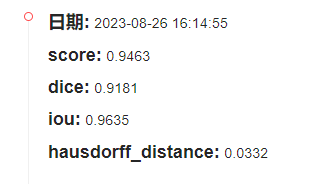
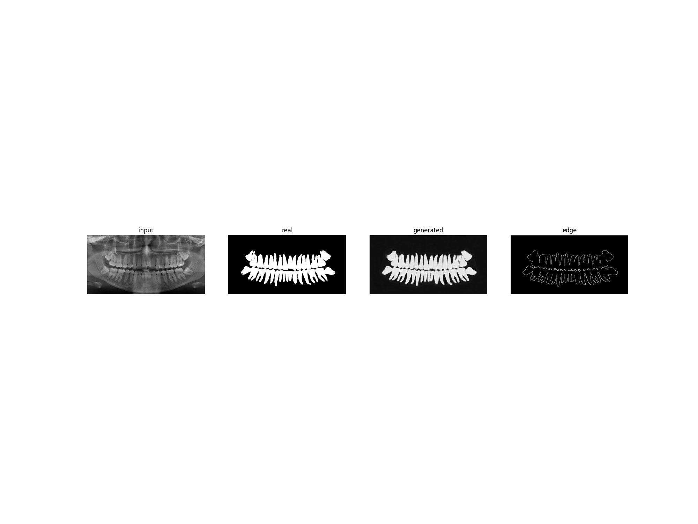

# AITOOTH
AITOOTH is our code for MICCAI 2023 Challenges ：STS-基于2D 全景图像的牙齿分割任务

# Model

We propose the RFM (Residual fusion module) module as the fundamental unit for the encoding and decoding process.  We find that the SK model has outstanding performance in feature layer fusion with convolution and group pre-processing.  Therefore, the SK structure is used to fuse the feature layers extracted by convolution and transformer.

In order to better converge the boundary, we propose a boundary learning module, which predicts the image boundary conditions after the feature layer is encoded, and then splices the predicted boundary results with the predicted mask on the channel dimension to fit the final boundary and mask results through a low-cost network

### alg core

First, use the group transformer to extract features, then use three-layer convolution to extract features, and then use the sk model to fuse the two features.

# Train

### Modify configuration file

```python
batch_size = 12
image_size = 320
train_path = r'/data0/lijunlin_data/teech/train/'
# replace your dataset path here
All_dataloader = Dataload(
    train_path, 
    image_shape =  (320, 640), #(240, 480), # (320, 640), #(256,256), #(320, 640),
    data_type = "train",
    need_gray = True,
    data_aug = 2,
    )
# set right image shape
```

### definition model

```python
method_dict = {
        0: "Unet",
        1: "RESUNet",
        2: 'RU',
        4: "GTU",
        41:"FL GTU",
        42:"GTU PVT",
        43:"GTU PVT MLP",
 		45:"GTU Diffusion"
        5: "FL",
        6: "Diffusion Unet"
        8: "FL tiny",
        9: "FL FPN",
        91: "FL FPN 4 8",
        92: "FL DETR ",
    }
trainer = Train( 
        1, image_size,
        name = "GTU_pvt_mlp",
        method_type = 43,
        is_show = False,
        batch_size = batch_size,
        device_ = "cuda:3",
        split = False,
)
print(device)
# trainer.load_parameter( "./save_best/GTU_pvt/best.pkl" )
trainer.train_and_test(100, train_loader, validate_loader)
```

### Run 

```shell
python train.py
```

# Inference

```shell
cd ./test
jupyter notebook
% open predict.ipynb to inference the model
```


# Results



Here is our result in tianchi rank board result and we got 129/839 rank,  Diffusion and Prompt is the future.

###### GTUPvtMlp Result


